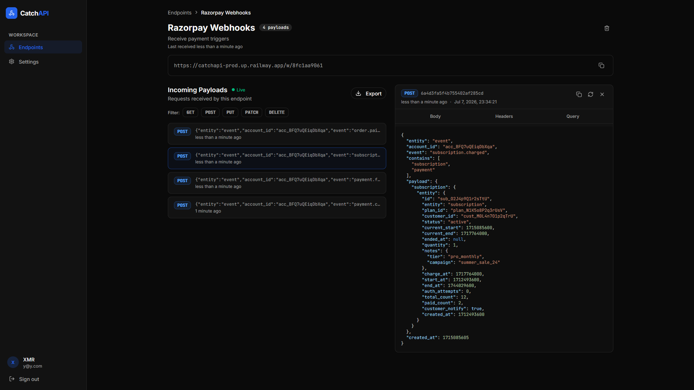

# CatchAPI

A webhook inspection tool. Point any service at a CatchAPI endpoint URL
and inspect every request it sends, headers, body, query params, in real time.

Built as a portfolio project to learn full-stack TypeScript, monorepo tooling,
and real-time web development.

Check the live deployment [Here](https://catchapi-web.vercel.app/)



## What it does

- Generate webhook endpoint URLs instantly
- Inspect incoming requests in real time via WebSockets
- Filter payloads by HTTP method
- View headers, body, and query params for each request
- Payloads auto-delete after 30 days

## Tech stack

**Backend**

- Node.js + Express 5
- MongoDB + Mongoose
- Socket.io for real-time delivery
- JWT authentication with refresh token rotation
- Pino for structured logging
- Swagger UI for API docs (`/api/docs`)

**Frontend**

- React 19 + Vite
- TanStack Query for server state
- Zustand for client state
- React Hook Form + Zod for form validation
- Tailwind CSS v4 + shadcn/ui
- Socket.io client for live payload feed

**Shared**

- `@catchapi/shared` — Zod schemas and TypeScript types shared between
  frontend and backend. One schema validates on the server and documents
  the API. The same schema validates on the client.

**Monorepo**

- pnpm workspaces
- Turborepo for build orchestration
- Husky + commitlint + lint-staged

## Local setup

**Prerequisites:** Node.js 22+, pnpm 10+, MongoDB running locally

```bash
# Clone the repo
git clone https://github.com/yourusername/catchapi.git
cd catchapi

# Install dependencies
pnpm install

# Set up environment variables
cp apps/api/.env.example apps/api/.env
cp apps/web/.env.example apps/web/.env
# Fill in apps/api/.env with your values

# Run everything
pnpm dev
```

Frontend runs on `http://localhost:3000`
Backend runs on `http://localhost:5000`
API docs at `http://localhost:5000/api/docs`

## Sending a test webhook

POST http://localhost:5000/w/<your-endpoint-url-id>
Content-Type: application/json
{ "hello": "world" }

The payload appears in the dashboard instantly.

## Architecture notes

- The shared package builds first — Turborepo's `dependsOn: ["^build"]`
  ensures this before the API or frontend start
- Refresh tokens are stored as SHA-256 hashes in MongoDB, never the raw token
- The refresh token lives in an httpOnly cookie — JavaScript can't read it
- Access tokens live in memory only — not localStorage, not sessionStorage
- Socket.io broadcasts new payloads directly into the TanStack Query cache —
  no polling, no full refetch
- Cursor pagination uses MongoDB ObjectId ordering — consistent performance
  regardless of collection size

## API docs

Available at `/api/docs` when the backend is running.
